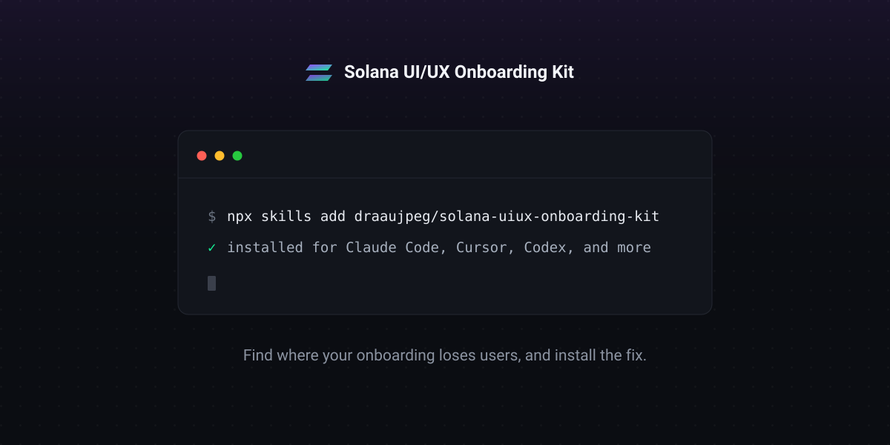

<p align="center">
  
</p>

<h1 align="center">Solana UI/UX Onboarding Kit</h1>

<p align="center">A research-backed kit that fixes where Solana onboarding loses users, ready to install into your agent.</p>

The Solana ecosystem was built by and for people who already understand seed phrases, self-custody, and the irreversibility of transactions. For everyone arriving from Web2, onboarding is where adoption breaks, and, in a context of irreversible money, where users either protect themselves or lose funds. This kit turns a heuristic study into reusable solutions: the **research** that proves the problem is systemic, the **design guidelines and components** that solve it, and an **agent skill** that applies them, so any product can fix its entry flow instead of repeating the same mistakes.

This work was supported by **SuperteamBR** (Solana).

**Who it's for:** designers, devs, and builders in the Solana ecosystem.

## What's inside

| Pillar | Folder | Description |
|---|---|---|
| 📖 Research synthesis (book) | [`docs/`](docs/) | The full heuristic analysis in chapters, published via [GitBook](https://matheus-draau.gitbook.io/solana-onboarding-kit) |
| 📐 Design Guidelines | [`design-guidelines/`](design-guidelines/) | The components that fill the friction map, the specs behind them, and the rules they are built to |
| 🤖 Agent skill | [`skills/solana-onboarding/`](skills/solana-onboarding/) | The whole kit as a skill that diagnoses an onboarding flow and builds the screens that fix it |

## Install

From the skills registry, one command:

```bash
npx skills add draaujpeg/solana-uiux-onboarding-kit
```

Or clone and run the installer, which takes `--project` to install into one
project and `--link` to keep it updated with a git pull:

```bash
git clone https://github.com/draaujpeg/solana-uiux-onboarding-kit
cd solana-uiux-onboarding-kit
./install.sh            # for the current user
./install.sh --project  # into this project only
./install.sh --link     # symlink instead of copy
```

Or copy `skills/solana-onboarding/` into your agent's skills directory by hand.
Any agent that reads Agent Skills works; the two directories below cover all of
them:

| Agent | Personal | Project |
|---|---|---|
| Claude Code, Cline | `~/.claude/skills/` | `.claude/skills/` |
| Codex, Copilot, Gemini CLI, Cursor, Windsurf, OpenCode | `~/.agents/skills/` | `.agents/skills/` |

## Use it

Say what you have. "Review the onboarding in this repo" runs an audit against the
same thirty questions the research used. "Our swap shows this error and users
vanish" finds the pattern and builds the screen. Components are copied into your
project, so you own and edit them, with nothing to keep updated.

New here? [`getting-started.md`](getting-started.md) is the shortest path in.

## Status

- ✅ **Research & synthesis**: complete ([`docs/`](docs/))
- ✅ **Design guidelines & components**: 21 components across the seven patterns
- ✅ **Agent skill**: routes, audits, and installs into your project

## License

This project is dual-licensed:

- **Code** — the Claude skill and design components — under the [MIT License](LICENSE).
- **Research & documentation** under `docs/` under [CC BY 4.0](docs/LICENSE).

You are free to fork, use, and build upon the material; attribution is required for the research content.
